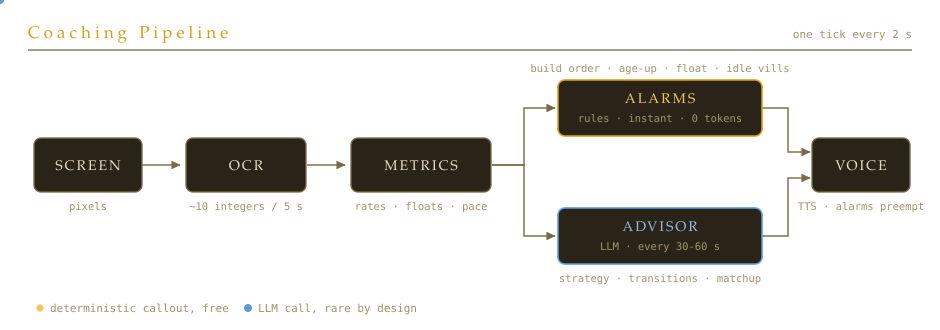

# An RTS-AI coach for Age of Empires II

<div style="display:flex; flex-wrap:wrap; gap:8px; margin:0 0 34px;">
  <span style="font-family:var(--font-mono); font-size:0.7rem; letter-spacing:0.08em; text-transform:uppercase; color:var(--text-2); border:1px solid var(--border); border-radius:100px; padding:5px 12px;">Eval-Driven Development</span>
  <span style="font-family:var(--font-mono); font-size:0.7rem; letter-spacing:0.08em; text-transform:uppercase; color:var(--text-2); border:1px solid var(--border); border-radius:100px; padding:5px 12px;">Real-Time AI</span>
  <span style="font-family:var(--font-mono); font-size:0.7rem; letter-spacing:0.08em; text-transform:uppercase; color:var(--text-2); border:1px solid var(--border); border-radius:100px; padding:5px 12px;">Token Optimization</span>
  <span style="font-family:var(--font-mono); font-size:0.7rem; letter-spacing:0.08em; text-transform:uppercase; color:var(--text-2); border:1px solid var(--border); border-radius:100px; padding:5px 12px;">Prompt Caching</span>
  <span style="font-family:var(--font-mono); font-size:0.7rem; letter-spacing:0.08em; text-transform:uppercase; color:var(--text-2); border:1px solid var(--border); border-radius:100px; padding:5px 12px;">LLM-as-Judge</span>
  <span style="font-family:var(--font-mono); font-size:0.7rem; letter-spacing:0.08em; text-transform:uppercase; color:var(--text-2); border:1px solid var(--border); border-radius:100px; padding:5px 12px;">OCR Pipeline</span>
</div>

I wanted to use AI for a domain where reality changes every few seconds. Most useful LLM applications today are post-processing: summarize the meeting after it happened, review the code after it's written, analyze the match after it's over. The model gets full context, thinks as long as it needs, and nobody is blocked waiting. Real-time play is the opposite. In a ranked game of Age of Empires II you make an economy decision roughly every ten seconds, and advice that arrives thirty seconds late describes a game that no longer exists.

So I built a copilot for AoE2. I think gaming copilots come next after coding copilots — packaged and sold as DLC. This one is deliberately lean. It watches a few zones of your screen, like the HUD, reads the numbers while you play, and talks back through text-to-speech, like a coach sitting behind you. "500 food banked, click Feudal Age now."

The goal is to take any beginner and supercharge them to 800-1000 ELO. The bet behind it: what separates a beginner from a decent ranked player is not game knowledge, it is execution. Villager production stops. Resources pile up unspent. The age-up click comes two minutes late. Better players simply don't do these things. A copilot that keeps you honest about them, calls a civilization-specific build order on time, and layers civ-specific micro optimizations on top is worth hundreds of ELO before any deep strategy enters the picture.

Two decisions made this work, and they are what this post is really about: the system is cheap on purpose, and it is tested with evals because TDD structurally cannot test it.

## The constraint that shaped everything

This has to run for a full match, up to an hour or more, react within seconds, and not cost real money per game. That rules out the obvious design of "send a screenshot to a vision model every few seconds." It's too slow, and at one call every five seconds, a single match racks up hundreds of large-context calls.

The design that falls out has three stages. Screen capture and OCR turn pixels into a handful of integers: food, wood, gold, stone, current age, the match clock. Plain code turns those integers into facts: gather rates per minute, whether you can afford the next age, whether a resource has been sitting unspent for twenty seconds. Only then does anything decide what to say, and the thing deciding is usually not an LLM.

<div style="overflow-x:auto; margin: 8px 0 24px;">
  
</div>

The split mirrors how a human coach works. Half of coaching is reflexes. The moment 500 food is banked and you haven't clicked up, say so. There is no judgment in that sentence, it is a threshold check, so it runs as a threshold check: a rules engine over the metrics, firing in the same two-second tick that noticed the condition, costing nothing. The other half is judgment. You are floating wood because your army just died and your building queue emptied, so what is the right next investment given your civilization and your opponent's? That is where the model earns its place, on a relaxed cadence where a few seconds of latency doesn't matter.

The two channels have a contract. Alarms always speak first, and the LLM yields the mic for ten seconds after any alarm, so you are never talked over during a time-critical callout. The LLM's prompt includes the last few things the alarms said, so it never repeats what you just heard.

## Being cheap on purpose

Token efficiency was not an optimization pass at the end. It is most of the architecture, and it is why this ships as something people leave running every match, not a demo they try once.

The deterministic channel handles the majority of spoken output, every build-order step, every age-up call, every float nag, at exactly zero tokens. During the scripted opening, roughly the first twelve minutes, the LLM is not called at all: the build order is fully known, so there is nothing for a model to decide. After that, the LLM channel is capped at one call per 30 seconds, and it skips the call entirely when the economy has barely moved since last time, which covers long stretches of turtling and fighting.

<div style="overflow-x:auto; margin: 8px 0 24px;">
  
</div>

When a call does happen, it stays small. The system prompt and civilization knowledge are byte-identical between calls, so they sit in the provider's prompt cache and cost a tenth of normal price after the first call. The variable part is a compact block of precomputed facts plus three sampled snapshots, and the reply is capped at 120 tokens, because two spoken sentences is the product. The model never does arithmetic on raw data; the code already did it. That is what lets the whole thing run on the smallest, fastest model in the lineup and still sound sharp.

This is the general pattern I would sell to anyone building real-time AI: spend the model only where judgment lives. Everything below judgment is sensors and reflexes, and reflexes should be code.

## Why TDD couldn't get me there, and what did

This is the part I most wanted to write about. The two failure modes that actually break this product are "the OCR read 1080 as 1030" and "the advice was grammatical but strategically useless." Neither has an assertable expected value. I cannot write `assert advice == "add two stables"`, because there are five defensible instructions in any game state. I cannot unit-test OCR against a screenshot I haven't captured yet, on a HUD layout I haven't seen. Test-driven development assumes you can specify the correct output before writing the code. For both of these failure modes, that specification does not exist.

Eval-driven development replaces the assertion with a measurement. The foundation is a session recorder: it captures every raw frame of a real match to disk, along with what the pipeline read from that frame at the time. A recorded session is a replayable artifact. You can re-run the entire vision pipeline over it offline, no game running, and diff the fresh readings against what was captured live.

```
data/sessions/20260701-174228/
├─ manifest.json    # per-cycle readings, phase, timings
└─ frames/          # raw full-monitor captures, one per cycle
```

On top of that artifact, each layer gets the cheapest form of testing that can actually catch its failures:

1. Metrics and alarms are pure functions and rules, so they get ordinary unit tests: 29 of them, running in a hundredth of a second on every commit. This is the part of the system where TDD works fine, and the architecture deliberately pushed as much behavior as possible into it.
2. OCR gets golden frames: hand-verified readings from recorded sessions, asserted per-commit. Hand-verified matters. If you only assert "replay matches recording," a systematic OCR bug passes by agreeing with itself.
3. Advice gets an LLM judge, run nightly rather than per-commit because it costs money and is not deterministic: recorded game timelines go through the advisor, and a judge model scores the output against a small human-rated set, tracking cost and latency alongside quality.

<div style="overflow-x:auto; margin: 8px 0 24px;">
<div style="min-width:720px; background:#211b13; border:1px solid #4a3f2a; border-radius:12px; padding:22px 24px; font-family:ui-monospace,'SF Mono',Menlo,monospace;">
  <div style="font-family:'Iowan Old Style','Palatino Linotype',Palatino,Georgia,serif; font-size:15px; letter-spacing:4px; text-transform:uppercase; color:#d4a017; padding-bottom:12px; border-bottom:1px solid #4a3f2a;">The Testing Ladder</div>
  <table style="border-collapse:collapse; width:100%; font-size:12.5px; color:#e9dcbe;">
    <tr style="text-align:left; color:#a4936f; font-size:11px; letter-spacing:1px; text-transform:uppercase;">
      <th style="padding:12px 12px 8px 0; font-weight:normal;">layer</th>
      <th style="padding:12px 12px 8px 0; font-weight:normal;">failure it catches</th>
      <th style="padding:12px 12px 8px 0; font-weight:normal;">test form</th>
      <th style="padding:12px 0 8px 0; font-weight:normal;">gate</th>
    </tr>
    <tr>
      <td style="padding:10px 12px 10px 0; border-top:1px solid #3a3122;">metrics + alarms</td>
      <td style="padding:10px 12px 10px 0; border-top:1px solid #3a3122; color:#a4936f;">wrong fact, missed callout</td>
      <td style="padding:10px 12px 10px 0; border-top:1px solid #3a3122;">unit tests</td>
      <td style="padding:10px 0; border-top:1px solid #3a3122;"><span style="background:#3a3122; color:#f0c75e; border-radius:4px; padding:2px 8px; font-size:11px;">every commit</span></td>
    </tr>
    <tr>
      <td style="padding:10px 12px 10px 0; border-top:1px solid #3a3122;">OCR + anchoring</td>
      <td style="padding:10px 12px 10px 0; border-top:1px solid #3a3122; color:#a4936f;">misread digits, drifted coordinates</td>
      <td style="padding:10px 12px 10px 0; border-top:1px solid #3a3122;">golden frames from recorded sessions</td>
      <td style="padding:10px 0; border-top:1px solid #3a3122;"><span style="background:#3a3122; color:#f0c75e; border-radius:4px; padding:2px 8px; font-size:11px;">every commit</span></td>
    </tr>
    <tr>
      <td style="padding:10px 12px 10px 0; border-top:1px solid #3a3122;">advice (LLM)</td>
      <td style="padding:10px 12px 10px 0; border-top:1px solid #3a3122; color:#a4936f;">useless or repetitive coaching</td>
      <td style="padding:10px 12px 10px 0; border-top:1px solid #3a3122;">LLM judge vs human-rated set</td>
      <td style="padding:10px 0; border-top:1px solid #3a3122;"><span style="background:#26313d; color:#8fbde6; border-radius:4px; padding:2px 8px; font-size:11px;">nightly</span></td>
    </tr>
  </table>
</div>
</div>

The recorder also changed how the product feels to build. Iterating on a prompt used to mean launching a match and playing badly on purpose. Now a recorded session replays into the live pipeline and drives the whole advice-and-voice loop from my desk, no game running.

## Where it goes

The system currently coaches six civilizations with hand-tuned build orders, and you can tell it your opponent's civilization at match start. It knows what a Briton player is going to do to you and which of their weaknesses to lean on. The honest gaps: golden frames exist as a plan and a recorder, not yet as a committed fixture set, and the advice judge is still scaffolding. Both sit on top of the session format that is already recording matches today.

If you take one thing from this post, take the altitude rule. Put the model exactly where judgment lives, and nowhere else. Below it, deterministic code that reads sensors and fires reflexes, testable the boring way. Above it, an eval harness built on recorded reality, because that is the only way to know whether the judgment is any good.

You can try out this copilot here: https://github.com/surajgaud/aoe2_copilot 